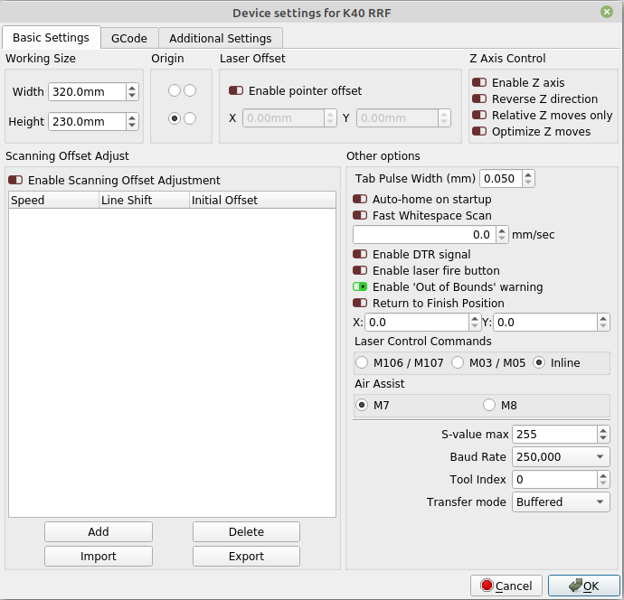
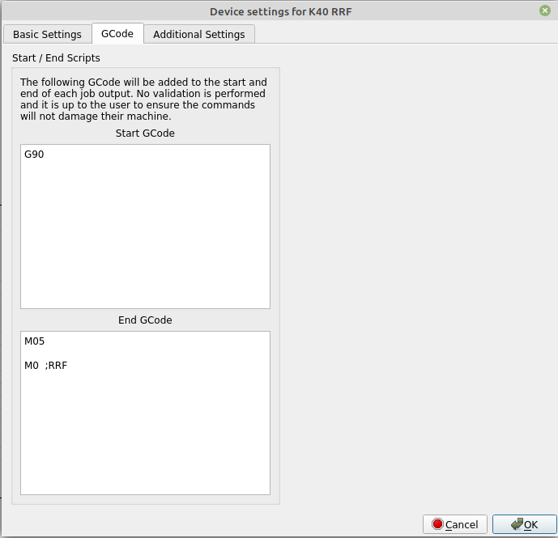

# K40 CO2 Laser

I rebuild my K40 CO2 Laser with RRF and water flow and temperature sensor, motorized bed, lid switch, resume button, air assist valve

## history
 December 2021, update wiring-diagram and add more detailed intructions in readme
 November 2021, add red laser, stl to mount and macros and link to motorized bed and Lightburn settings.

## Features
 - to not start a job when the lid is open
 - pause a job when the lid is opened while processing
 - pause when the water flow / temperature is out of range *
 - red laser for positionining the working laser (see 3d folder for stl I use to mount it, M3 melt nut needed)

## Hardware
 - K40 CO2 Laser
 - Bigtreetech SKR 2 board with ESP8266 WiFi Module (ESP07 with external antenna connector!)
 - Additional 24 V Power Supply with around 4A like: https://www.amazon.com/-/de/dp/B005T6QACW/ref=sr_1_10?__mk_de_DE=%C3%85M%C3%85%C5%BD%C3%95%C3%91&dchild=1&keywords=mean+well+24v+4.2a&qid=1625996292&sr=8-10
 - 24V magnetic air valve like: https://www.amazon.com/-/de/dp/B08F9QR5CY/ref=sr_1_29?__mk_de_DE=%C3%85M%C3%85%C5%BD%C3%95%C3%91&dchild=1&keywords=24v+magnetic+air+valve&qid=1625995968&sr=8-29
  -Flow Sensor like: https://www.amazon.com/-/de/dp/B00VKATCRQ/ref=sr_1_3?__mk_de_DE=%C3%85M%C3%85%C5%BD%C3%95%C3%91&dchild=1&keywords=flow+sensor+30+l&qid=1625996079&sr=8-3
  - an 3D printer thermistor
  - the motorized bed with pancake stepper from her: https://www.thingiverse.com/thing:4869148
  - end stop switch like: https://www.amazon.com/-/de/dp/B06XFL4MZ2/ref=sr_1_21?__mk_de_DE=%C3%85M%C3%85%C5%BD%C3%95%C3%91&dchild=1&keywords=end+stop+switch&qid=1625996215&sr=8-21
  - resume button like: https://www.amazon.com/-/de/dp/B08DV7TFVQ/ref=twister_B08ZSWCYCD?_encoding=UTF8&psc=1
  - red laser diode, 5V

The config also includes the controll for an motorized laser bed I create and publish the STL and FreeCad files here:
https://www.thingiverse.com/thing:4869148

## Wiring

I connect the components above like shown here:


## Setup

setup the SKR 2 Firmware with at least the latest 3.4beta6 Version (for high speed raster engraving) and the ESP 1.26 Version or higher.

To get the best web Interface (Duet Web Control) for Laser use this Version to get the water flow (rpm) and temperature shown in the dashboard:
https://github.com/Duet3D/DWC-CNC/releases

use the files in sys sub folder to setup your K40 and check the machine limits and stepper direction as usual.

## red laser details
https://forum.duet3d.com/topic/26130/red-laser-diode-to-align-worksheet

## ToDo

* ~~the daemon.g whom should check the water flow and temperature and pause the job is currently not working because there is an issue with the RRF Version 3.3_2 (2021-06-19) which causes the board to reboot after about 15 minutes uptime when there is some SD I/O interaction.~~ --> fixed in current RRF 3.3.0_5 (2021-07-25) 

## Lightburn Settings

to use Lightburn to create the GCode for the K40 I use this settings there:





# Instructions

this are parts of the detailed informations I found here:
https://teamgloomy.github.io/index.html

## source parts
 - SKR 2 
 - ESP32 WiFi Module
 - 32GB Class 10 MicroSD Card with wear leveling
 - Lid Switch
 - Optional Flow Sensor
 - Optional Thermistor
 - Optional Red Laser Diode
 - Optional Resume Button

## Download Firmware and preapre SD Card

Latest 3.4 Version of RRF Firmware for STM WiFi from here:
https://github.com/gloomyandy/RepRapFirmware/releases

Place firmware-stm32f4-wifi-3.4.0beta6_1.bin in the SD Card root and rename it to firmware.bin

Download the latest STM32 ESP32 Firmware from here:
https://github.com/gloomyandy/DuetWiFiSocketServer/releases

create a sub folder "firmware" on the SD Card and download the DuetWiFiServer-esp32-stm32f4-1.26-08.bin there and rename it to DuetWiFiServer.bin

Download latest DWC (DuetWebControl) for CNC from here:
https://github.com/Duet3D/DWC-CNC/releases/download/3.3.0-CNC08/DuetWebControl-SD.zip

Extract the archive and place the content in the www folder of the SD Card

Download the sys folder from this repository and place it on the sd card root either.

## Flash board firmware
When you then install the micro SD Card in the board and power it on, the firmware would be flashed within 20 seconds, then the board reboots

## Connect with USB and some serial console
I would recoment to use Repetier Host on any OS and connect the board USB to the PC / Laptop, then set the Repetier Connection to use the Serial interface the board offers. In Repetier host you then can send commands over serial

## Flash ESP32 Firmware
After the board firmware is installed and the serial console is connected send teh following comands:
```
M552 S0
M997 S1
M552 S0
```
The serial output should show an progress in flashing the ESP32 firmware

## Set WiFi credentials
After the board and ESP32 firmware is flashed you need to set your WiFi Credentials with
```
M552 S-1
M552 S0
M587 S"your SSID" P"your password"
M552 S1
```

Now the serial output should show you the IP address of DWC which you can open on any HTML5 browser!

After that you can controll / setup your machine, first check in DWC / System the config.g file and change it to your needs, the file is commented and if you not clear which GCode command do what just consult the wiki  hier:
https://duet3d.dozuki.com/Wiki/Gcode
