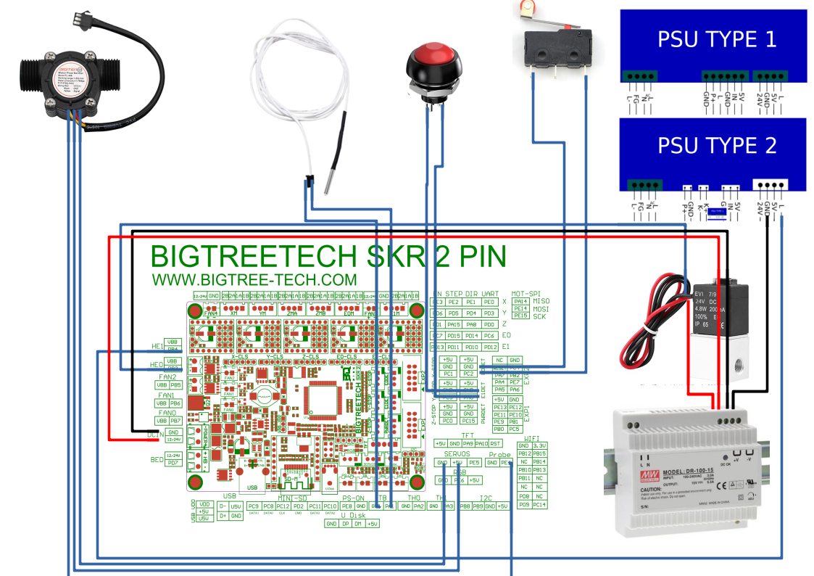

# K40 CO2 Laser

I rebuild my K40 CO2 Laser with RRF and water flow and temperature sensor, motorized bed, lid switch, resume button, air assist valve

## Features
 - to not start a job when the lid is open
 - pause a job when the lid is opened while processing
 - pause when the water flow / temperature is out of range *

## Hardware

 - K40 CO2 Laser
 - Bigtreetech SKR 2 board with ESP8266 WiFi Module (ESP07 with external antenna connector!)
 - Additional 24 V Power Supply with around 4A like: https://www.amazon.com/-/de/dp/B005T6QACW/ref=sr_1_10?__mk_de_DE=%C3%85M%C3%85%C5%BD%C3%95%C3%91&dchild=1&keywords=mean+well+24v+4.2a&qid=1625996292&sr=8-10
 - 24V magnetic air valve like: https://www.amazon.com/-/de/dp/B08F9QR5CY/ref=sr_1_29?__mk_de_DE=%C3%85M%C3%85%C5%BD%C3%95%C3%91&dchild=1&keywords=24v+magnetic+air+valve&qid=1625995968&sr=8-29
  -Flow Sensor like: https://www.amazon.com/-/de/dp/B00VKATCRQ/ref=sr_1_3?__mk_de_DE=%C3%85M%C3%85%C5%BD%C3%95%C3%91&dchild=1&keywords=flow+sensor+30+l&qid=1625996079&sr=8-3
  - an 3D printer thermistor
  - the motorized bed with pancake stepper from her: https://www.thingiverse.com/thing:4869148
  - end stop switch like: https://www.amazon.com/-/de/dp/B06XFL4MZ2/ref=sr_1_21?__mk_de_DE=%C3%85M%C3%85%C5%BD%C3%95%C3%91&dchild=1&keywords=end+stop+switch&qid=1625996215&sr=8-21
  - resume button like: https://www.amazon.com/-/de/dp/B08DV7TFVQ/ref=twister_B08ZSWCYCD?_encoding=UTF8&psc=1

## Wiring

I connect the components above like shown here:

## Setup

setup the SKR 2 Firmware with at least the latest 3.3 Version and the ESP 1.26 Version or higher.

To get the best web Interface (Duet Web Control) for Laser / CNC use the CNC Version here:
https://github.com/ulsanether/DuetWebControl-cnc

use the files in sys sub folder to setup your K40 and check the machine limits and stepper direction as usual.

## ToDo

* the daemon.g whom should check the water flow and temperature and pause the job is currently not working because there is an issue with the RRF Version 3.3_2 (2021-06-19) which causes the board to reboot after about 15 minutes uptime when there is some SD I/O interaction.

Glommyandy is informed and will check / correct this in the next release I guess.